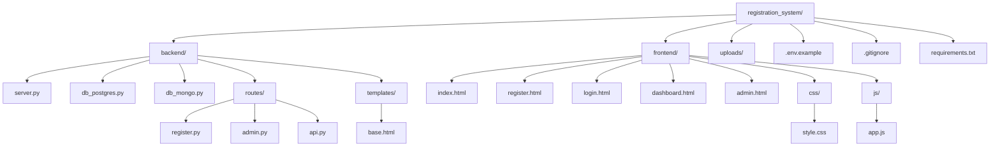

# 📁 Project Structure

## Complete File Tree

```plaintext
registration_system/
│
├── backend/                         # Python backend server
│   ├── server.py                   # Main HTTP server (entry point)
│   ├── db_postgres.py              # PostgreSQL database operations
│   ├── db_mongo.py                 # MongoDB database operations
│   ├── routes/                     # API route handlers
│   │   ├── __init__.py            # Makes routes a Python package
│   │   ├── register.py            # Registration & login endpoints
│   │   ├── admin.py               # Admin management endpoints
│   │   └── api.py                 # General API endpoints
│   └── templates/                  # HTML templates
│       └── base.html              # Base template for pages
│
├── frontend/                        # Static frontend files
│   ├── index.html                 # Landing page
│   ├── register.html              # Registration form (20+ fields)
│   ├── login.html                 # User login page
│   ├── dashboard.html             # User dashboard
│   ├── admin.html                 # Admin panel
│   ├── css/
│   │   └── style.css             # Responsive CSS styles
│   └── js/
│       └── app.js                # Frontend JavaScript logic
│
├── uploads/                         # Uploaded files (auto-created)
│   └── .gitkeep                   # Keep directory in version control
│
├── .env.example                    # Environment variables template
├── .gitignore                      # Git ignore rules
├── requirements.txt                # Python dependencies
├── PROJECT_STRUCTURE.md            # This file
└── README.md                       # Project documentation
```

## Visual Structure (Mermaid)



## Key Files Description

| File | Purpose | Key Features |
|------|---------|--------------|
| `backend/server.py` | Main HTTP server | Routing, session management, API handlers |
| `backend/db_postgres.py` | PostgreSQL handler | User CRUD, metadata, JSONB support |
| `backend/db_mongo.py` | MongoDB handler | Activity logs, sessions, form submissions |
| `frontend/register.html` | Registration page | 20+ field types, file uploads |
| `frontend/css/style.css` | Styles | Responsive design, modern UI |
| `frontend/js/app.js` | Frontend logic | Validation, API calls, real-time checks |

## Database Schema

### PostgreSQL Tables
| Table | Purpose |
|-------|---------|
| `users` | User accounts, profiles, authentication |
| `user_metadata` | JSONB flexible metadata storage |
| `email_tokens` | Email verification tokens |

### MongoDB Collections
| Collection | Purpose |
|------------|---------|
| `activity_logs` | User activity tracking |
| `form_submissions` | Dynamic form data storage |
| `user_sessions` | Session management |

## API Endpoints

| Method | Endpoint | Handler | Access |
|--------|----------|---------|--------|
| POST | `/api/register` | `register.py` | Public |
| POST | `/api/login` | `register.py` | Public |
| POST | `/api/check-availability` | `register.py` | Public |
| GET | `/api/session` | `api.py` | Authenticated |
| POST | `/api/upload` | `api.py` | Authenticated |
| POST | `/api/save-form-data` | `api.py` | Authenticated |
| GET | `/api/user-activity` | `api.py` | Authenticated |
| GET | `/api/form-submissions` | `api.py` | Authenticated |
| GET | `/api/users` | `admin.py` | Admin only |
| POST | `/api/update-user` | `admin.py` | Admin only |
| GET | `/api/stats` | `admin.py` | Admin only |
